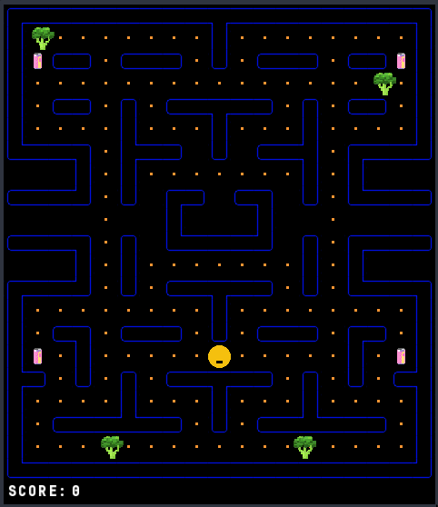

# Mac-Man
A Pac-Man inspired game built with C++ and SFML. Feel

Feel free to play it, modify it, break it, anything you like.

### Objectives
A similar concept to most recognized versions of Pac-Man, except you are insanely hungry. The normal pellets have been reconceptualized into potato chips 🟡, power pellets became insanely addicting soda 🥤, and ghosts became vegetables 🥦 because who likes veggies??? If you consume the soda, you will begin to see ghosts as edible Big Macs 🍔.

### Build
0. make sure you have SFML library installed on your system (Windows might be more complicated, I haven't tried)

1. run at ./
```
$ make
```

2. run at ./
```
$ ./MacMan
```

### Game Screenshot
<div style="text-align:center">
  
</div>
